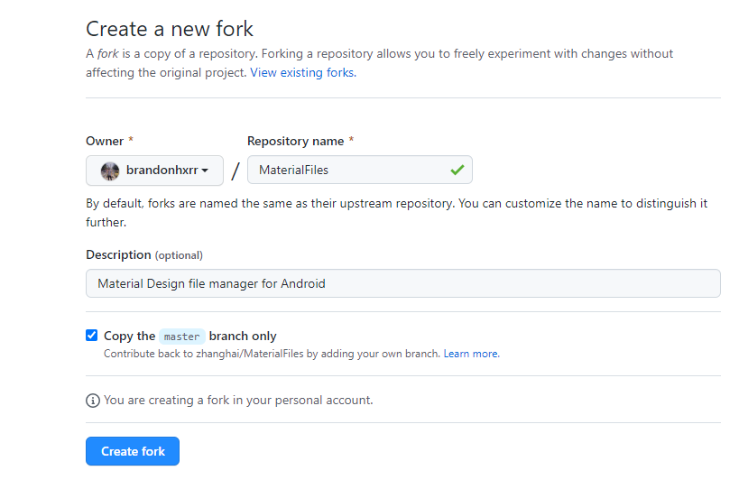
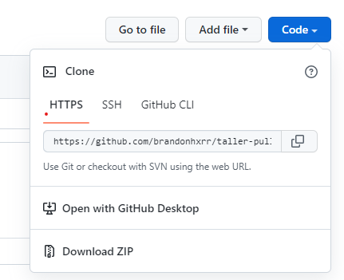

# Creando tu primer Pull Request

_Aprende a crear tu primer pull request y comienza tu camino en el Open Source_<br>


Sigue las instrucciones paso a paso.

## Paso 1: Haz un fork del repositorio

Haz una copia del repositorio a tu cuenta de GitHub haciendo un Fork.


1. Haz clic en el botón 'Fork' en la esquina superior derecha del repositorio.

   
2. Verás una pantalla similar a la siguiente:

   
3. Haz clic en  **Create fork** y verás el repositorio en tu cuenta.<br>

## Paso 2: Clonar el repositorio

Clona el repositorio en tu computadora haciendo click en el botón **Code** y copiando la URL que aparece ahí.

   <br>
Luego, ejecuta el siguiente comando en tu consola:
   ```
   bash git clone url
   ```
Donde url es la URL que copiaste en el paso anterior.<br>

## Paso 3: Haz cambios

Edita el archivo `CONTRIBUTORS.md` en tu computadora:
   Agrega tu nombre y tu usuario de GitHub en la última línea del archivo de la siguiente manera:
   ```
   * Nombre de usuario: [usuario de GitHub](url del perfil de GitHub)
   ```
   **Ejemplo:**
   ```
   * Brandon Herrera: [brandonhxrr](https://github.com/brandonhxrr/)
   ```
   <br>

## Paso 4: Guarda los cambios

   Guarda tus cambios y ejecuta el siguiente comando en tu consola:
  
   ```
   git add CONTRIBUTORS.md
   git commit -m "Agregué mi nombre y usuario de GitHub (nombre de usuario)"
   ```
  <br>

## Paso 5: Sube tus cambios a GitHub
   
   Sube tus cambios a tu repositorio en GitHub:

   ```
   git push origin main
   ```
   <br>

## Paso 6: Crea un Pull Request
   
   En tu repositorio en GitHub, haz clic en el botón **Compare & pull request**.
   
   

   Si no hay ningún conflicto, llena los campos del formulario y haz clic en **Create pull request**.

   
   <br>

## Espera a que tu Pull Request sea aceptado
      
   ¡Listo! Tu Pull Request será revisado y aceptado si cumple con los requisitos.
   <br><br><br>

## ¡Felicidades! 🎉
   ¡Has creado tu primer Pull request! ¡Ahora eres parte del Open Source!
 